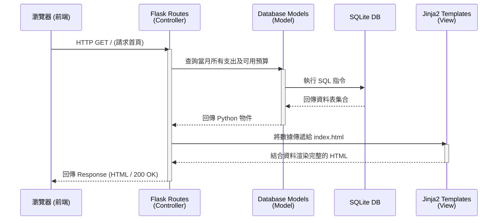

# 系統架構設計 (ARCHITECTURE) - 個人記帳簿系統

## 1. 技術架構說明

本專案定位為輕量化、易於開發與維護的網頁應用程式，以滿足 MVP 版本所定義的核心功能（快速記帳、圖表分析、自訂類別與預算提醒）。基於快速開發考量，我們採用以下的技術配置：

- **後端框架：Python + Flask**
  - **原因**：Flask 是一個微型 Web 框架，學習曲線平滑，且具有高度的靈活性。開發者可以自由決定架構，用最簡潔的程式碼滿足 API 和路由需求。
- **模板引擎：Jinja2**
  - **原因**：內建於 Flask。這個專案不需要前後端分離（SPA 開發模式），將由伺服器（Flask）組合資料和 Jinja2 模板來負責 HTML 的渲染，然後將完整頁面傳回給用戶端，可大幅減少前端開發的成本與複雜度。
- **資料庫：SQLite**
  - **原因**：輕量、無須額外安裝伺服器，資料是以單一檔案的形式存放。對於個人的記帳應用來說，無論是在效能或部署便利性上，都是最好的選擇。
- **前端呈現：HTML5 + CSS + JavaScript**
  - **原因**：採用原生的網頁開發技術。前端將主要負責樣式的設計（RWD）、提供順暢的瀏覽體驗，以及透過圖表庫（如 Chart.js）渲染資料。

### MVC 架構模式說明
為了讓專案不會因程式碼膨脹而難以維護，我們將採用軟體設計中常見的 MVC (Model-View-Controller) 概念來劃分元件職責：
- **Model (模型)**：負責反映資料庫的結構。定義收支紀錄、用戶自定義的類別及預算的資料表，並負責資料的新增、讀取、修改及刪除（CRUD）。
- **View (視圖)**：負責呈現使用者介面。在本專案中即是 **Jinja2 模板與靜態檔案 (HTML/CSS)**，負責將 Controller 傳遞下來的資料以視覺化的方式展示給用戶。
- **Controller (控制器)**：在 Flask 當中，**路由 (Routes) 函式** 扮演此角色。負責接收來自使用者的操作與請求，調用對應的 Model 處理資料後，再呼叫 Template 將資料渲染回去給瀏覽器。

## 2. 專案資料夾結構

為了讓邏輯清晰、元件解耦，以下是我們規劃的資料夾與檔案結構：

```text
web_app_development2/
├── app.py                # 主程式進入點，進行 Flask 初始化與路由註冊
├── requirements.txt      # 專案相依套件清單 (如 Flask, SQLAlchemy)
├── docs/                 # 系統文件
│   ├── PRD.md            # 產品需求文件
│   └── ARCHITECTURE.md   # 本系統架構文件
├── instance/             # 不進入版控的環境檔案
│   └── database.db       # SQLite 資料庫儲存檔
└── app/                  # 應用邏輯層
    ├── models/           # --- 資料庫模型 ---
    │   └── models.py     # 定義 Transaction (收支)、Category (類別)、Budget (預算) 
    ├── routes/           # --- 路由 Controller ---
    │   ├── __init__.py   # 使該目錄成為 Python Module
    │   ├── dashboard.py  # 負責首頁統計、餘額計算、圖表資料
    │   ├── transaction.py# 負責收支紀錄的新增、刪除、編輯
    │   └── settings.py   # 負責類別管理與設定預算的邏輯
    ├── templates/        # --- HTML 模板 View ---
    │   ├── base.html     # 共用版型 (Navigation, Header, Footer)
    │   ├── index.html    # 儀表板頁面 (總結與分析圖表)
    │   ├── records.html  # 所有收支明細的清單管理
    │   └── settings.html # 預設管理與類別新增頁面
    └── static/           # --- 靜態檔案 ---
        ├── css/
        │   └── style.css # 網頁排版與樣式設定
        └── js/
            └── main.js   # 圖表套件初始化、表單前端驗證邏輯
```

## 3. 元件關係圖

以下利用 Mermaid 圖表展示使用者瀏覽頁面時，前端與後端不同模組之間的互動關係：



## 4. 關鍵設計決策

1. **整合後端渲染與圖表庫的混搭寫法**
   - **原因**：純後端渲染比較難做出炫目的動態分析圖表（例如圓餅圖）。因此我們的決策是：多數頁面使用 Jinja2 直接渲染成 HTML，但在圖表部分，利用 Jinja2 將計算好的後端數據輸出至 `<script>` 變數中，交由前端套件（如 Chart.js 或 Echarts）動態繪製，這樣兼顧了 SSR（伺服器渲染）的簡便和圖表的美觀。
2. **利用 Blueprint 拆分路由檔案**
   - **原因**：為了長遠可讀性，我們選擇不將所有路由邏輯擠在單一的 `app.py` 中。在 `app/routes/` 下，規劃出不同的業務邏輯（dashboard, transaction, settings），再利用 Flask Blueprint 將它們註冊至主應用中。
3. **無複雜登入機制的個人環境定位 (首版)**
   - **原因**：根據 PRD 要求，本產品的初期目標是「個人記帳」。為了縮小範圍並加速驗證需求，第一版暫時不開發複雜的多使用者的帳號註冊/登入系統。資料庫是以單機使用情境去做 Schema 設計（例如紀錄不需要額外綁定 user_id）。
4. **超支計算設計在 Controller 端**
   - **原因**：為了減輕資料庫運算負擔並維持邏輯靈活性，「判斷預算是否超支」的邏輯將在 Flask 的 Controller 計算，而不是使用資料庫的觸發器 (Trigger) 或預存程序 (Stored Procedures)。這可以讓我們更容易抽換判斷規則以及傳送提醒到前端。
