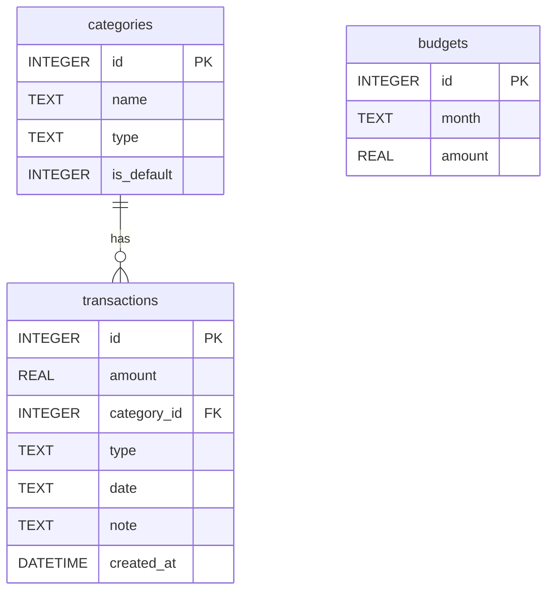

# 資料庫設計 (DB_DESIGN) - 個人記帳簿系統

## 1. 實體關係圖 (ER 圖)

這張 ER 圖展示了本系統內三個資料表 (`transactions`, `categories`, `budgets`) 之間的欄位型別，以及「一對多」的相對關聯性。

## 2. 資料表詳細說明

### 2.1 收支明細表 (`transactions`)
記錄所有使用者的消費與收入。
| 欄位名稱 | 型別 | 必填 | 說明 |
| :--- | :--- | :--- | :--- |
| `id` | INTEGER | 是 | Primary Key 自動遞增 |
| `amount` | REAL | 是 | 收支金額（保留浮點數支援） |
| `category_id` | INTEGER | 否 | Foreign Key 對應到 `categories.id` |
| `type` | TEXT | 是 | 限定為 'income' (收入) 或 'expense' (支出) |
| `date` | TEXT | 是 | 對應的消費日期 (格式 YYYY-MM-DD) |
| `note` | TEXT | 否 | 使用者填寫的明細備註 |
| `created_at`| DATETIME| 是 | 紀錄建立的時間，預設為 `CURRENT_TIMESTAMP` |

### 2.2 類別表 (`categories`)
包含系統預設分類，以及開放給使用者自行新增的自訂類別。
| 欄位名稱 | 型別 | 必填 | 說明 |
| :--- | :--- | :--- | :--- |
| `id` | INTEGER | 是 | Primary Key 自動遞增 |
| `name` | TEXT | 是 | 類別的中文或英文字稱呼 (如「午餐」、「交通」) |
| `type` | TEXT | 是 | 限定為 'income' (收入) 或 'expense' (支出) |
| `is_default`| INTEGER | 否 | 1 代表不可刪除的系統預設類別，0 代表自訂 |

### 2.3 預算表 (`budgets`)
管理各月份的支出預算上限，支援按月切換預算以防超支。
| 欄位名稱 | 型別 | 必填 | 說明 |
| :--- | :--- | :--- | :--- |
| `id` | INTEGER | 是 | Primary Key 自動遞增 |
| `month` | TEXT | 是 | YYYY-MM 月份字串，加入 UNIQUE 約束 |
| `amount` | REAL | 是 | 這個月份的預算額度上限數字 |

## 3. 實作位置
- **建表語法**：位於 `database/schema.sql`，可直接用 sqlite3 工具建立結構。
- **後端模型**：基於原生的 `sqlite3` 提供簡潔高效的資料庫連線，並切割到 `app/models/` 各資料表對應的 .py 檔案中。包含建立、讀取全部、依單月查詢與增刪改機制。
