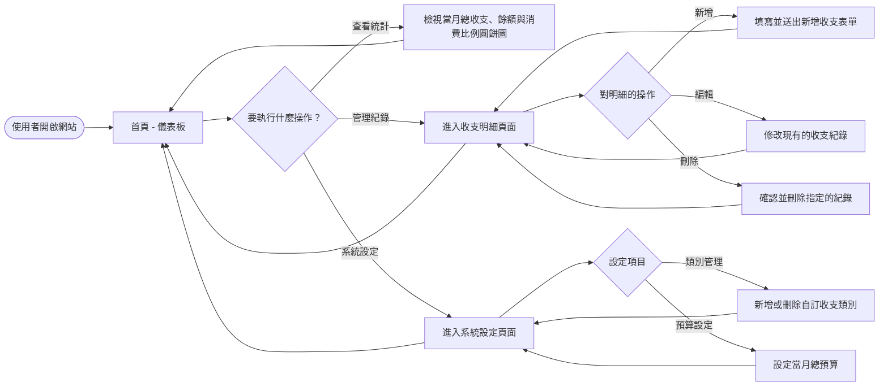
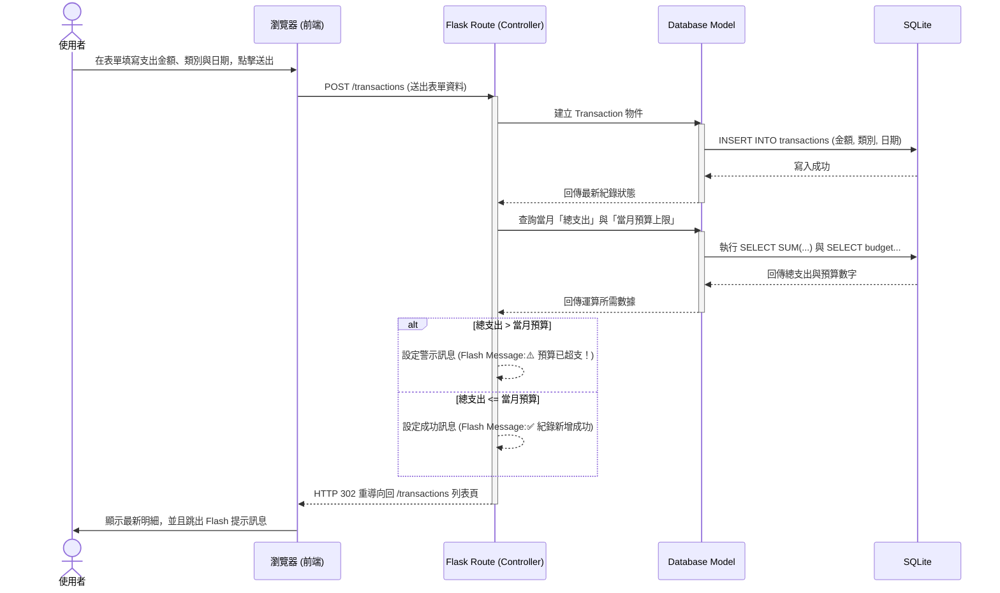

# 流程圖設計 (FLOWCHART) - 個人記帳簿系統

## 1. 使用者流程圖 (User Flow)

這張流程圖展示了使用者在網站上操作的主要路徑，涵蓋操作儀表板、管理收支明細，以及進行自訂類別與預算設定。

## 2. 系統序列圖 (Sequence Diagram)

這張序列圖描述了本系統的核心功能：「使用者新增一筆支出紀錄，同時系統檢查是否超過預算」的詳細資料流動過程與元件互動關係。

## 3. 功能清單對照表

本表列出系統每個功能所對應的 URL 路徑、HTTP 方法與負責的邏輯，這將作為開發階段 API 與路由設計的基礎。

| 功能區塊 | HTTP 方法 | URL 路徑 | 用途說明 |
| :--- | :--- | :--- | :--- |
| **儀表板** | GET | `/` | 系統首頁，顯示本月餘額總結、最新紀錄預覽與分類圓餅圖。 |
| **收支明細** | GET | `/transactions` | 以列表形式列出所有的收支明細紀錄。 |
| **收支明細** | POST | `/transactions` | 接收表單資料，新增一筆收支紀錄。 |
| **收支明細** | POST | `/transactions/<id>/edit` | 修改特定 ID 的收支紀錄。 |
| **收支明細** | POST | `/transactions/<id>/delete` | 刪除特定 ID 的收支紀錄。 |
| **設定/類別** | GET | `/settings` | 顯示預算設定與類別管理的介面。 |
| **設定/類別** | POST | `/settings/budget` | 接收表單資料，更新當月的預算設定。 |
| **設定/類別** | POST | `/settings/categories` | 接收表單資料，新增一筆自訂類別。 |
| **設定/類別** | POST | `/settings/categories/<id>/delete`| 刪除特定的自訂類別。 |

> **備註：**
> 由於標準的 HTML `<form>` 表單僅支援 `GET` 與 `POST` 方法，實作上我們用 `POST` 搭配 URL 結尾的 `/edit` 或 `/delete` 來處理修改與刪除的請求，而不是嚴格的 RESTful (PUT/DELETE) 設計，以減輕純後端渲染架構的負擔。
